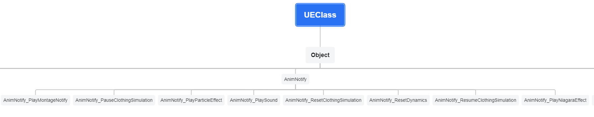
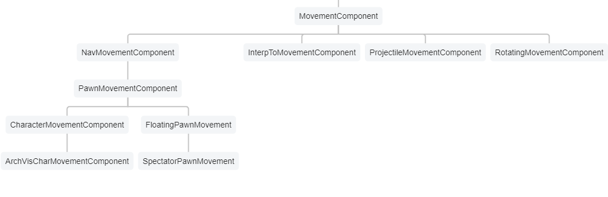
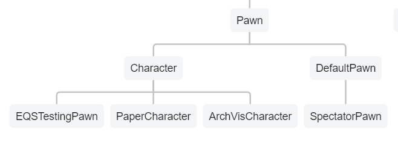
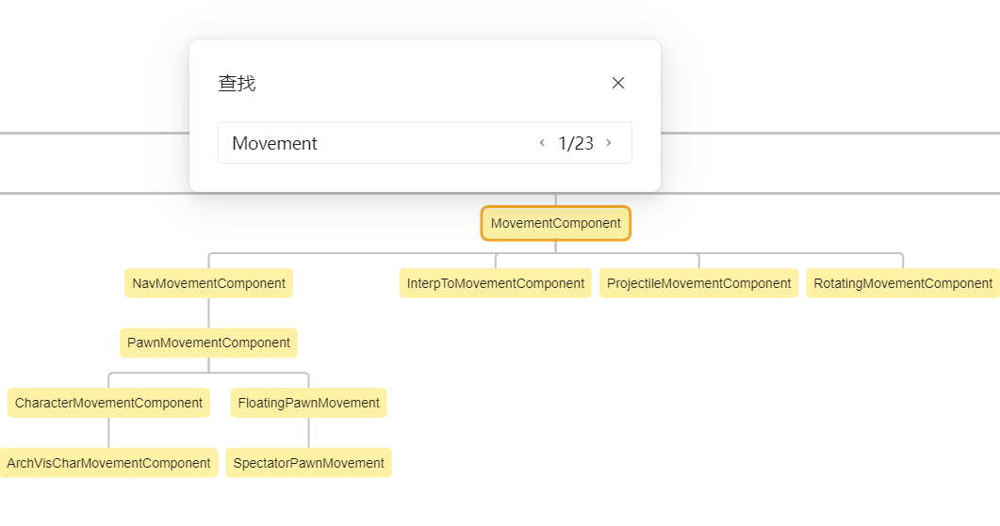
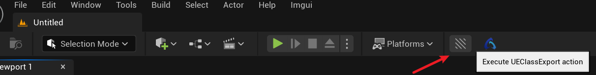

# UEClassExport

An Unreal(5.4) plugin to export xmind of unreal classes

## 1. Xmind 

**Xmind online:**[=>Click here](https://docs.qq.com/mind/DSGR6TVdGUlZJenZl?mode=mind&_t=1717434876611&needShowTips=1)
**Xmind File:** [=>Repository file](https://github.com/wlxklyh/UEClassExport/blob/main/UEClassXmind.xmind)

|Example|Picture|
|-|-|
|1. AnimNotify||
|2.MovementComponent||
|3.SubSystem||
|4.Pawn||

Tencent doc online can find your class you want and you can copy the text.

## 2. How to use?

#### 2.1 Install python requirement(requirements.txt).
#### 2.2 Download this rep to plugins directory. And then build the project. 
#### 2.3 And then press the button.
